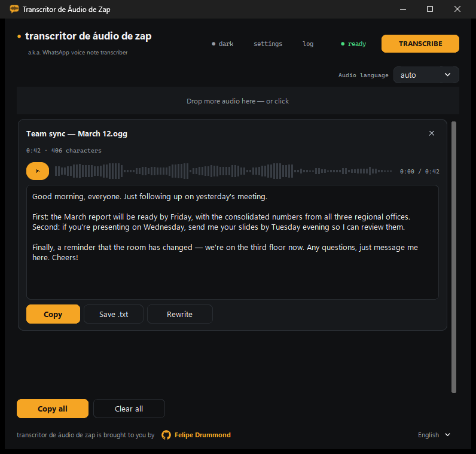
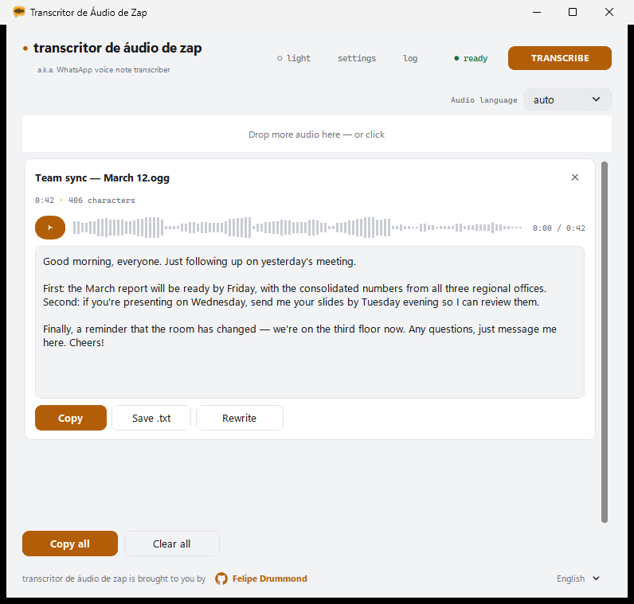
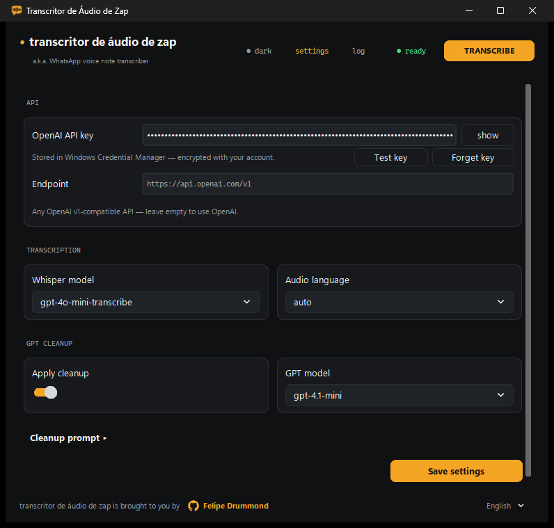
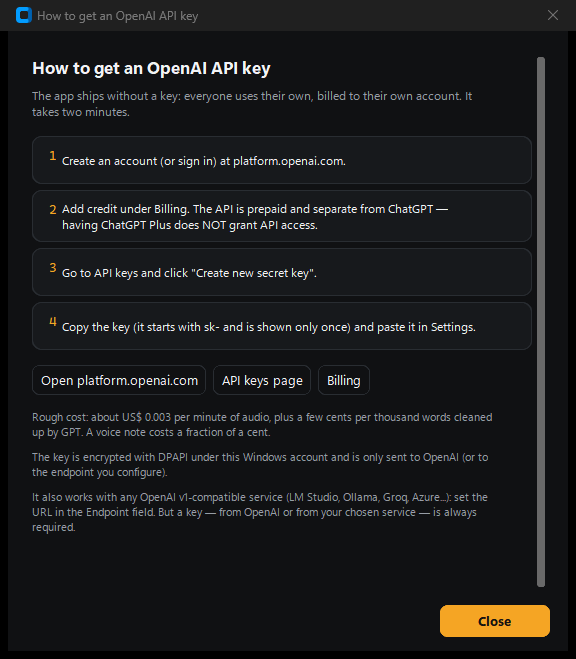

<div align="center">


# Transcritor de Áudio de Zap

**WhatsApp voice note transcriber for Windows** — drag a voice message in, get clean text out.

*("zap" is what Brazilians call WhatsApp)*

[](#download)
[](#development)
[](https://platform.openai.com/docs/guides/speech-to-text)
[](LICENSE)

[Download](#download) · [Features](#features) · [Build](#build) · [Privacy](PRIVACY.md) · [Security](SECURITY.md) · [Português (BR)](README.pt-BR.md)



</div>

Turn WhatsApp voice notes (and any other audio) into clean, readable text using the **OpenAI Whisper API**, with an optional **GPT cleanup** pass that fixes punctuation, removes filler words and keeps the meaning untouched. A small, native Windows app — no install, no account, no telemetry.

## What it does

1. Drag one or more audio files onto the window (or click to choose them).
2. Each file gets its own waveform, sent to Whisper, and optionally cleaned up by GPT.
3. Copy the result, save it as `.txt`, or copy everything at once.

<table>
<tr>
<td width="50%"><br><em>Light theme — follows Windows automatically</em></td>
<td width="50%"><br><em>Settings — key stored in Windows Credential Manager</em></td>
</tr>
</table>

## Features

- **Drag & drop** — drop one or several files at once onto the window; a second drop adds to the queue instead of replacing it.
- **Per-file waveform** — a unique visual signature derived from each file's bytes. The same waveform pulses while the file is transcribing, then becomes the player's seek bar once the result is ready.
- **Integrated player** — listen to the audio right next to its transcription, with seek.
- **Light / dark theme** — follows Windows automatically (including the title bar), or can be pinned manually with the header button, which cycles ◐ auto → ○ light → ● dark.
- **Multilingual interface** — pick the UI language in the footer's bottom-right selector (each option written in its own language): Auto (follows Windows), Português, English, Español, falling back to English if Windows reports another language. The change applies instantly — no restart, and transcriptions already on screen are kept.
- **Transcription models** — `gpt-transcribe` (default, recommended), `gpt-4o-mini-transcribe`, `gpt-4o-transcribe`, and legacy `whisper-1`. See [Recommended models](#recommended-models).
- **Audio language** — defaults to `auto`, letting Whisper detect it; pick a specific language to pin it. The selector appears both on the main screen (next to the drop area) and in Settings, and the two stay in sync.
- **GPT cleanup** — optional post-processing pass with an editable prompt (placeholder `{transcricao}`). The default prompt ships in eight languages (pt, en, es, fr, de, it, ja, zh) and follows the interface language; if the audio language is one the interface doesn't cover (fr, de, it, ja, zh), that one wins, since it's the language of the text being cleaned. Editing the prompt makes it custom, and a custom prompt never changes on its own — "Restore default" brings back the current language's version.
- **Rewrite** — give the GPT a free-form instruction about the transcribed text (e.g. "summarize", "translate to English").
- **OpenAI v1-compatible endpoint** — point the app at any API compatible with the OpenAI v1 spec via the Endpoint field; leave it empty to use OpenAI directly.
- **Test key** — verifies the API key with a `GET {base}/models` call and reports how many models are available.
- **Copy / Save .txt / Copy all** — editable result text with a live character count.

## Security / API key

The API key is **never written to a plain-text file**. It is stored in the **Windows Credential Manager**, encrypted per-account via DPAPI, under the target `TranscritorDeAudio/OpenAI`. If an older `config.json` still has a plain-text `api_key`, the app scrubs it from the file on load and migrates it into the Credential Manager automatically. The "Forget key" button in Settings deletes it from the vault. "Test key" performs a `GET {base}/models` request to confirm the key works without saving anything extra.

## An API key is required — there is no way around it

**This app does not transcribe anything on its own.** It is a client: the audio is sent to a speech-to-text service, and that service needs an API key. Without one, nothing works.

You have two options, and both need a key:

1. **OpenAI** (the default) — create a key at [platform.openai.com/api-keys](https://platform.openai.com/api-keys). See [How to get a key](#how-to-get-an-openai-api-key) below.
2. **Any OpenAI v1-compatible service** — LM Studio, Ollama, Groq, Azure OpenAI, or your own server. Point the **Endpoint** field at it. The infrastructure doesn't have to be OpenAI's, but that service will still require its own key.

The app never ships with a key, and the author's key is never involved: **you pay only for what you transcribe, on your own account.**

### How to get an OpenAI API key

The app has this same guide built in — click **"How do I get a key?"** in Settings, and it opens with clickable links.

<div align="center"></div>

1. Create an account (or sign in) at [platform.openai.com](https://platform.openai.com/signup).
2. **Add credit under [Billing](https://platform.openai.com/settings/organization/billing/overview).** The API is prepaid and **separate from ChatGPT** — having ChatGPT Plus does **not** grant API access. This is the step most people miss.
3. Go to [API keys](https://platform.openai.com/api-keys) and click **Create new secret key**.
4. Copy it (it starts with `sk-` and is shown only once) and paste it into the app.

**Cost:** roughly **US$ 0.0045 per minute of audio**, plus less than half a cent per thousand words rewritten. A typical WhatsApp voice note costs about half a cent — a few dollars of credit last a very long time.

## Recommended models

The defaults are already the recommended combination — you don't need to change anything:

| Task | Default | Why |
|---|---|---|
| **Transcription** | **`gpt-transcribe`** | OpenAI's current file-transcription model. This is the one to use. |
| **Rewrite** | **`gpt-5.6-luna`** | Cleanup and rewriting are simple, high-volume tasks: Luna is the fast, low-cost tier of the GPT-5.6 family and handles them well. |

The `gpt-4o-*` models are the previous generation and remain in the list for endpoints that don't expose the newer ones yet. `whisper-1` is the legacy model, kept only for third-party compatibility — **it is not recommended**.

## Requirements

- Windows 10 or 11, 64-bit.
- Your own OpenAI API key (or a key for a compatible service — see above).
- Internet connection (transcription happens on OpenAI's servers, or on the endpoint you configure).

## Download

**[⬇ Download the latest release](https://github.com/ffapd1989/voice-note-transcriber/releases/latest)** — a single `.exe` inside a zip. Extract and run; nothing needs to be installed.

On first run you'll paste your own OpenAI API key. It goes straight into the Windows Credential Manager, so you only do this once.

> **SmartScreen warning:** the executable is not digitally signed (code-signing certificates are expensive), so Windows shows a blue "Windows protected your PC" screen the first time. Click **More info** → **Run anyway**. It appears only once.

## Development

Run directly from source (Python 3.10+, developed on 3.14):

```powershell
pip install -r requirements.txt
python transcricao_app.py
```

Versions in `requirements.txt` are pinned (`==`) for reproducible builds.

## Build

```powershell
.\build.ps1        # builds dist\transcrizap.exe
.\build.ps1 -Zip   # also produces Transcritor-de-Audio-de-Zap-v2.4.0-win64.zip
```

The script (PowerShell 7) checks for Python, installs dependencies, and runs PyInstaller with `transcritor.spec` (onefile, no console). UPX compression is disabled (`upx=False`) because UPX-compressed executables are a classic false-positive trigger for antivirus software — a bad tradeoff for something you're sending to friends. The PyInstaller work path is set outside the project folder, because Google Drive locks newly created temp files and breaks `--clean`. The window and executable icon come from `assets/icone.ico` (an amber chat bubble with a waveform inside, generated by script).

## Configuration

Stored at `%APPDATA%\TranscricaoApp\config.json`. The API key is **never** part of this file — see Security above.

| Key | Type | Default |
|---|---|---|
| `appearance` | string | `"system"` (`system` / `light` / `dark`) |
| `ui_language` | string | `"auto"` (`auto` / `pt` / `en` / `es`) |
| `base_url` | string | `"https://api.openai.com/v1"` |
| `whisper_model` | string | `"gpt-transcribe"` (recommended) |
| `gpt_model` | string | `"gpt-5.6-luna"` (recommended) |
| `language` | string | `"auto"` — Whisper detects the language; any other value pins it |
| `apply_cleanup` | bool | `true` |
| `cleanup_prompt` | string | `""` — empty means "use the built-in prompt for the current language". Only a custom prompt is stored here, with `{transcricao}` as the placeholder for the raw transcription |

## Supported formats

MP3, MP4, M4A, OGG, OGA, OPUS (WhatsApp), WAV, WEBM, FLAC.

The Whisper API accepts files up to 25 MB; the app checks this before uploading, and offers to automatically compact (re-encode at a lower bitrate) any file over that limit, via a bundled static [FFmpeg](https://ffmpeg.org) (LGPL) binary.

## Known issues

- **OGG/Opus playback:** transcription always works regardless of format. Playback inside the built-in player depends on `pyogg` successfully decoding the file (it fails silently if it can't); the player falls back to no playback in that case. Use MP3/M4A/WAV if you need to listen to the audio inside the app.

## Credits

Brought to you by **Felipe Drummond** — [@ffapd1989](https://github.com/ffapd1989)

An amateur programmer working with AI (a.k.a. a *vibe coding* hobbyist), whose day
job is being a Public Defender at DPE-RS — the Public Defender's Office of Rio
Grande do Sul, Brazil — and whose mission is using information technology to
improve access to justice.

## License

MIT — see [LICENSE](LICENSE).
