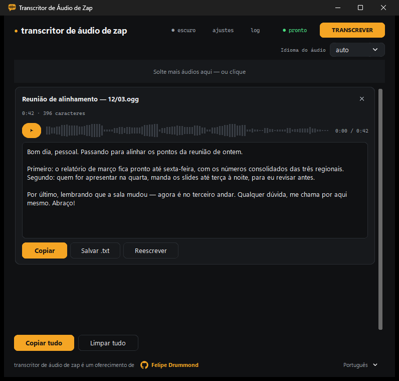
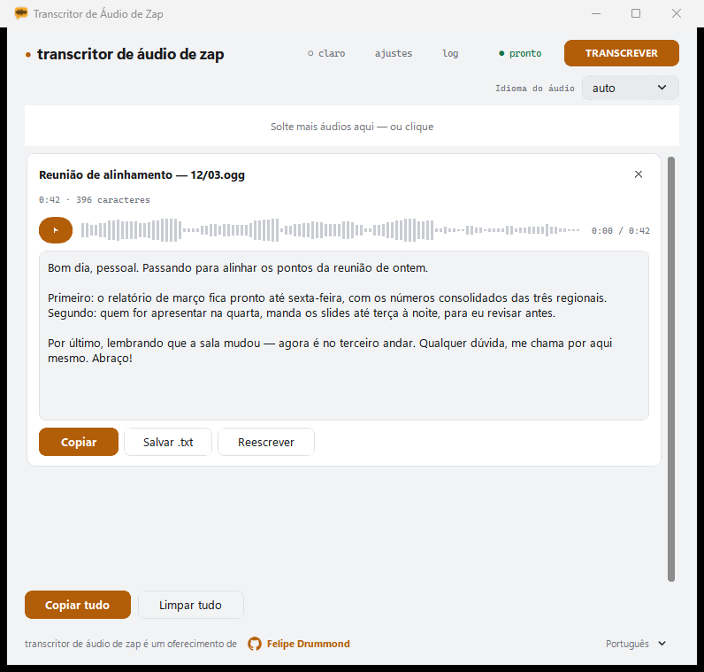
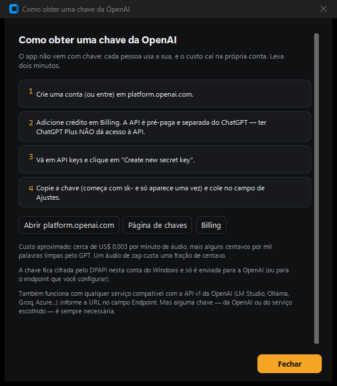

<div align="center">


# Transcritor de Áudio de Zap

**Transcreve áudio de zap no Windows** — arraste a mensagem de voz, receba o texto limpo.

[](#download)
[](#desenvolvimento)
[](https://platform.openai.com/docs/guides/speech-to-text)
[](LICENSE)

[Baixar](#download) · [Funcionalidades](#funcionalidades) · [Build](#build-do-execut%C3%A1vel) · [English](README.md)



</div>

Transforma áudios do WhatsApp (e qualquer outro áudio) em texto limpo usando a **API Whisper da OpenAI**, com uma passada opcional de **limpeza por GPT** que corrige pontuação, tira muletas de fala e não mexe no sentido do que foi dito. App nativo para Windows — sem instalação, sem cadastro, sem telemetria.

## O que ele faz

1. Arraste um ou vários arquivos de áudio para a janela (ou clique para escolher).
2. Cada arquivo ganha sua própria forma de onda, é enviado ao Whisper e, opcionalmente, limpo pelo GPT.
3. Copie o resultado, salve como `.txt`, ou copie tudo de uma vez.

<div align="center">

<br><em>Tema claro — acompanha o Windows automaticamente</em>
</div>

## Funcionalidades

- **Drag & drop** — solte um ou vários arquivos de uma vez na janela; um segundo drop acrescenta à fila em vez de substituí-la.
- **Forma de onda por arquivo** — assinatura visual única derivada dos bytes de cada arquivo. A mesma onda pulsa enquanto o arquivo está sendo transcrito e vira a barra de seek do player assim que o resultado fica pronto.
- **Player integrado** — ouça o áudio ao lado da transcrição, com seek.
- **Tema claro/escuro** — segue o Windows automaticamente (inclusive a barra de título), ou pode ser fixado manualmente pelo botão no topo, que alterna ◐ auto → ○ claro → ● escuro.
- **Interface multilíngue** — escolha o idioma no seletor do canto inferior direito do rodapé (cada opção escrita no próprio idioma): Auto (segue o Windows), Português, English, Español, com fallback para inglês caso o Windows informe outro idioma. A troca vale na hora — sem reiniciar, e as transcrições já na tela são preservadas.
- **Modelos de transcrição** — `gpt-4o-mini-transcribe` (padrão, recomendado), `gpt-4o-transcribe` e o antigo `whisper-1`. Veja [Modelos recomendados](#modelos-recomendados).
- **Idioma do áudio** — o padrão é `auto`, deixando o Whisper detectar; escolha um idioma específico para fixá-lo. O seletor aparece tanto na tela principal (ao lado da área de arrastar) quanto nos Ajustes, e os dois ficam sincronizados.
- **Limpeza GPT** — pós-processamento opcional com prompt editável (placeholder `{transcricao}`). O prompt padrão existe em oito idiomas (pt, en, es, fr, de, it, ja, zh) e acompanha o idioma da interface; se o idioma do áudio for um que a interface não cobre (fr, de, it, ja, zh), ele é que vale, por ser o idioma do texto a limpar. Editar o prompt o torna personalizado, e um prompt personalizado nunca muda sozinho — "Restaurar padrão" traz de volta a versão do idioma atual.
- **Reescrever** — dê ao GPT uma instrução livre sobre o texto transcrito (ex.: "resuma", "traduza para o inglês").
- **Endpoint compatível com OpenAI v1** — aponte o app para qualquer API compatível com a especificação v1 da OpenAI pelo campo Endpoint; deixe vazio para usar a OpenAI diretamente.
- **Testar chave** — verifica a chave de API com uma chamada `GET {base}/models` e informa quantos modelos estão disponíveis.
- **Copiar / Salvar .txt / Copiar tudo** — texto do resultado editável, com contagem de caracteres em tempo real.

## Segurança / chave de API

A chave de API **nunca é gravada em arquivo de texto plano**. Ela fica guardada no **Gerenciador de Credenciais do Windows**, cifrada por conta via DPAPI, sob o alvo `TranscritorDeAudio/OpenAI`. Se um `config.json` antigo ainda tiver um `api_key` em texto plano, o app remove essa chave do arquivo ao carregar e a migra automaticamente para o Gerenciador de Credenciais. O botão "Esquecer chave" nas Configurações a apaga do cofre. "Testar chave" faz uma requisição `GET {base}/models` para confirmar que a chave funciona, sem gravar nada além disso.

## A chave de API é imprescindível — não tem como fugir disso

**O app não transcreve nada sozinho.** Ele é um cliente: o áudio é enviado a um serviço de reconhecimento de fala, e esse serviço exige uma chave de API. Sem chave, nada funciona.

Existem dois caminhos, e os dois pedem chave:

1. **OpenAI** (o padrão) — crie uma chave em [platform.openai.com/api-keys](https://platform.openai.com/api-keys). Veja [Como obter uma chave](#como-obter-uma-chave-da-openai) abaixo.
2. **Qualquer serviço compatível com a API v1 da OpenAI** — LM Studio, Ollama, Groq, Azure OpenAI ou seu próprio servidor. Basta apontar o campo **Endpoint** para ele. A infraestrutura não precisa ser da OpenAI, mas esse serviço também vai exigir a chave dele.

O app nunca vem com chave embutida, e a chave do autor jamais é usada: **você paga apenas pelo que transcrever, na sua própria conta.**

### Como obter uma chave da OpenAI

O app tem esse mesmo guia embutido — clique em **"Como consigo uma chave?"** nos Ajustes e ele abre com os links prontos.

<div align="center"></div>

1. Crie uma conta (ou entre) em [platform.openai.com](https://platform.openai.com/signup).
2. **Adicione crédito em [Billing](https://platform.openai.com/settings/organization/billing/overview).** A API é pré-paga e **separada do ChatGPT** — ter ChatGPT Plus **não** dá acesso à API. Esse é o passo que quase todo mundo esquece.
3. Vá em [API keys](https://platform.openai.com/api-keys) e clique em **Create new secret key**.
4. Copie a chave (começa com `sk-` e só aparece uma vez) e cole no app.

**Custo:** cerca de **US$ 0,003 por minuto de áudio**, mais alguns centavos por mil palavras limpas pelo GPT. Um áudio de zap típico custa uma fração de centavo — alguns dólares de crédito duram muitíssimo tempo.

## Modelos recomendados

Os padrões já são a combinação recomendada — você não precisa mexer em nada:

| Tarefa | Padrão | Por quê |
|---|---|---|
| **Transcrição** | **`gpt-4o-mini-transcribe`** | Mais preciso que o `whisper-1` e mais barato. É esse que se deve usar. |
| **Limpeza GPT** | **`gpt-4.1-nano`** | Limpeza é tarefa simples e volumosa: o nano resolve pontuação e muletas de fala muito bem, por uma fração do preço dos modelos maiores. |

O `gpt-4o-transcribe` está disponível para quem quiser o modelo de transcrição maior. O `whisper-1` é o modelo antigo e está na lista apenas por compatibilidade com endpoints de terceiros que ainda não expõem os novos — **não é recomendado**.

## Requisitos

- Windows 10 ou 11, 64 bits.
- Sua própria chave de API da OpenAI (ou de um serviço compatível — veja acima).
- Conexão com a internet (a transcrição acontece nos servidores da OpenAI, ou no endpoint que você configurar).

## Download

**[⬇ Baixar a última versão](https://github.com/ffapd1989/voice-note-transcriber/releases/latest)** — um único `.exe` dentro de um zip. Descompacte e execute; não precisa instalar nada.

Na primeira execução você cola a sua chave da OpenAI. Ela vai direto para o Gerenciador de Credenciais do Windows, então isso é feito uma vez só.

> **Aviso do SmartScreen:** o executável não tem assinatura digital (certificados de code signing são caros), então o Windows mostra a tela azul "O Windows protegeu o computador" na primeira vez. Clique em **Mais informações** → **Executar assim mesmo**. Só aparece uma vez.

## Desenvolvimento

Rode direto a partir do código-fonte (Python 3.10+, desenvolvido em 3.14):

```powershell
pip install -r requirements.txt
python transcricao_app.py
```

As versões em `requirements.txt` são fixadas (`==`) para builds reproduzíveis.

## Build

```powershell
.\build.ps1        # gera dist\transcrizap.exe
.\build.ps1 -Zip   # além do exe, gera Transcritor-de-Audio-de-Zap-v2.2.1-win64.zip
```

O script (PowerShell 7) verifica o Python, instala as dependências e roda o PyInstaller com o `transcritor.spec` (onefile, sem console). A compressão UPX fica desativada (`upx=False`), porque executáveis comprimidos com UPX são um gatilho clássico de falso-positivo em antivírus — uma troca ruim para algo que você vai enviar a amigos. O workpath do PyInstaller fica fora da pasta do projeto, porque o Google Drive trava arquivos temporários recém-criados e quebra o `--clean`. O ícone da janela e do executável vem de `assets/icone.ico` (um balão de conversa âmbar com uma forma de onda dentro, gerado por script).

## Configuração

Salva em `%APPDATA%\TranscricaoApp\config.json`. A chave de API **nunca** faz parte desse arquivo — veja Segurança acima.

| Chave | Tipo | Default |
|---|---|---|
| `appearance` | string | `"system"` (`system` / `light` / `dark`) |
| `ui_language` | string | `"auto"` (`auto` / `pt` / `en` / `es`) |
| `base_url` | string | `"https://api.openai.com/v1"` |
| `whisper_model` | string | `"gpt-4o-mini-transcribe"` (recomendado) |
| `gpt_model` | string | `"gpt-4.1-nano"` (recomendado) |
| `language` | string | `"auto"` — o Whisper detecta o idioma; qualquer outro valor o fixa |
| `apply_cleanup` | bool | `true` |
| `cleanup_prompt` | string | `""` — vazio significa "usar o prompt embutido do idioma atual". Só um prompt personalizado é gravado aqui, com `{transcricao}` como placeholder da transcrição bruta |

## Formatos suportados

MP3, MP4, M4A, OGG, OGA, OPUS (WhatsApp), WAV, WEBM, FLAC.

A API do Whisper aceita arquivos de até 25 MB; o app confere isso antes de enviar.

## Problemas conhecidos

- **Reprodução de OGG/Opus:** a transcrição funciona sempre, independentemente do formato. A reprodução dentro do player embutido depende do `pyogg` conseguir decodificar o arquivo (falha silenciosamente se não conseguir); nesse caso o player fica sem reprodução. Use MP3/M4A/WAV se precisar ouvir o áudio dentro do app.

## Créditos

Um oferecimento de **Felipe Drummond** — [@ffapd1989](https://github.com/ffapd1989)

Programador amador com IA (a.k.a. hobbista do *vibe coding*), tem como ocupação
principal ser Defensor Público na DPE-RS e, como missão, usar tecnologia da
informação para melhorar o acesso à justiça.

## Licença

MIT — veja [LICENSE](LICENSE).
